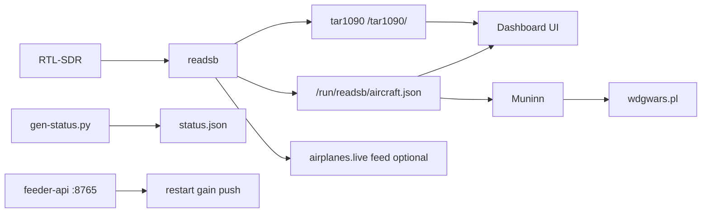

# Architecture

## Data flow

## Components

| Piece | Role |
|-------|------|
| `readsb` | Decodes ADS-B from SDR; writes `/run/readsb/aircraft.json` |
| `tar1090` | Serves live map and JSON at `/tar1090/data/*` |
| `airplanes-feed` / `airplanes-mlat` | Optional upstream to airplanes.live |
| `adsb-docker` / `adsb-setup` | adsb.im Docker stack and web UI (`FEED_PROFILE=adsbim`) |
| `dashboard/` | Static HTML/JS UI + `gen-status.py` |
| `feeder-api` | Local HTTP API on `127.0.0.1:8765`, proxied at `/dashboard/api/` |
| `muninn/` | WDGoWars uploader (submodule) |
| `feeder-watch` | Restarts readsb if SDR present but decoder down |

**Split stack:** SDR + readsb stay on the Pi; dashboard, alerts, and WDGoWars run on a Docker host. The Pi runs **pi-agent** (`:8780`) to expose aircraft data and ops. See [SPLIT-STACK.md](SPLIT-STACK.md).

## Timers (systemd user)

| Timer | Interval | Action |
|-------|----------|--------|
| `feeder-dashboard.timer` | 30s | Regenerate `status.json` + history |
| `feeder-watch.timer` | 60s | SDR / readsb recovery check |
| `muninn-upload.timer` | configurable | WDGoWars upload via `upload-if-ready.sh` |

## Ports

| Port | Service |
|------|---------|
| 80 | lighttpd (dashboard, tar1090) |
| 8765 | feeder-api (localhost only) |
| 30004 / 64004 | airplanes.live beast feed (outbound) |
| 31090 | airplanes.live MLAT (outbound) |

## Key files

| Path | Purpose |
|------|---------|
| `feeder.env` | Install paths and `FEED_PROFILE` (`airplanes`, `adsbim`, `readsb-only`) |
| `dashboard/status.json` | Aggregated status for UI |
| `dashboard/history.json` | 24h chart data |
| `logs/upload.log` | Muninn upload log |
| `logs/upload-history.json` | Last upload summaries |

## Security model

- Dashboard and API are served on the LAN without authentication.
- `feeder-ops` sudoers allows only specific `systemctl restart` and `readsb-gain` commands.
- Do not expose port 80 to the public internet without adding auth or a VPN.
