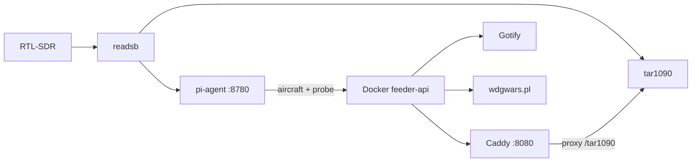

# Split-stack deployment

Run **decode on the Pi** and **dashboard + alerts + WDGoWars on your Docker machine**.



## What runs where

| Pi (decode host) | Docker host |
|------------------|-------------|
| readsb, tar1090, airplanes feed | Dashboard UI + API |
| lighttpd `/tar1090/` only (optional) | Gotify alerts |
| **pi-agent** (HTTP API) | Flight log, analytics |
| feeder-watch (SDR recovery) | Muninn / WDGoWars uploads |
| | Caddy proxies `/tar1090/` → Pi |

## 1. Pi — decode only

On the Raspberry Pi (with readsb + tar1090 already running):

```bash
cd /path/to/adsb-feeder-dashboard
./scripts/install-pi-decode-only.sh
```

This installs **pi-agent** on port `8780` and **feeder-watch**. It stops the local dashboard timers.

Save the printed `PI_AGENT_TOKEN` — you need it on Docker.

Optional: remove the old dashboard from lighttpd so only tar1090 is served locally:

```bash
sudo rm /etc/lighttpd/conf-enabled/89-feeder-dashboard.conf
sudo systemctl reload lighttpd
```

**Security:** pi-agent should only be reachable on your LAN or Tailscale. Set a strong `PI_AGENT_TOKEN` in `feeder.env`. Do not expose port 8780 to the public internet.

## 2. Docker — dashboard stack

On your Docker machine:

```bash
cd adsb-feeder-dashboard/docker
cp .env.example .env
# Edit: PI_HOST, PI_AGENT_URL, PI_AGENT_TOKEN, GOTIFY_*, DASHBOARD_PORT
../scripts/install-split-docker.sh
```

Open: `http://<docker-host>:8080/dashboard/`

The live map iframe uses `/tar1090/`, proxied by Caddy to your Pi.

## 3. Gotify

Gotify can stay where it is (`https://alerts.lacdh.live`). Set `GOTIFY_URL` and `GOTIFY_APP_TOKEN` in `docker/.env` and in Settings.

## 4. WDGoWars

Configure the API key in **Settings** on the Docker dashboard (same as before). Uploads run inside the Docker container using synced `aircraft.json` from the Pi.

## Environment reference

### Pi (`feeder.env`)

| Variable | Example |
|----------|---------|
| `PI_AGENT_TOKEN` | long random string |
| `PI_AGENT_PORT` | `8780` |

### Docker (`docker/.env`)

| Variable | Purpose |
|----------|---------|
| `PI_HOST` | Pi IP for tar1090 proxy |
| `PI_AGENT_URL` | `http://pi:8780` |
| `PI_AGENT_TOKEN` | same as Pi |
| `DASHBOARD_PORT` | host port (default `8080`) |
| `GOTIFY_URL` | Gotify server |
| `GOTIFY_APP_TOKEN` | app token |

## pi-agent API

| Endpoint | Method | Purpose |
|----------|--------|---------|
| `/v1/aircraft` | GET | `aircraft.json` |
| `/v1/stats` | GET | `stats.json` |
| `/v1/probe` | GET | services, SDR, location, feeds |
| `/v1/ops/restart/readsb` | POST | restart decoder |
| `/v1/ops/restart/all` | POST | restart all feeder units |
| `/v1/ops/gain` | POST | `{"gain":"auto"}` |
| `/v1/ops/location` | POST | `{"lat","lon","alt"}` |

All requests use `Authorization: Bearer <PI_AGENT_TOKEN>` when a token is set.

## Troubleshooting

| Symptom | Check |
|---------|--------|
| Dashboard empty aircraft | `curl -H "Authorization: Bearer $TOKEN" $PI_AGENT_URL/v1/aircraft` |
| Map blank | Pi tar1090 on port 80; `PI_HOST` correct; Caddy can reach Pi |
| Ops buttons fail | pi-agent sudoers; token matches |
| Gotify silent | `GOTIFY_URL` reachable from Docker host |
| WDGoWars no upload | API key in Settings; `/data/upload-schedule.json` enabled |

## Reverting to all-on-Pi

```bash
./scripts/install.sh --profile airplanes
systemctl --user disable --now pi-agent.service
```
